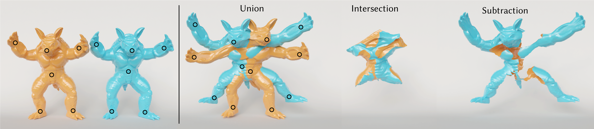

# Interactive And Robust Mesh Booleans

This is the code of the mesh booleans pipeline presented in the paper ["**Interactive And Robust Mesh Booleans**"](#) by [G. Cherchi](https://www.gianmarcocherchi.com), [F. Pellacini](https://pellacini.di.uniroma1.it), [M. Attene](https://www.cnr.it/en/people/marco.attene) and [M. Livesu](http://pers.ge.imati.cnr.it/livesu/) (ACM TOG, SIGGRAPH Asia 2022). 

